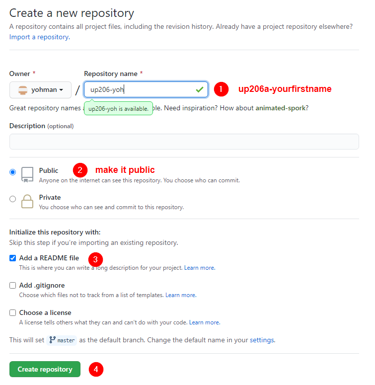
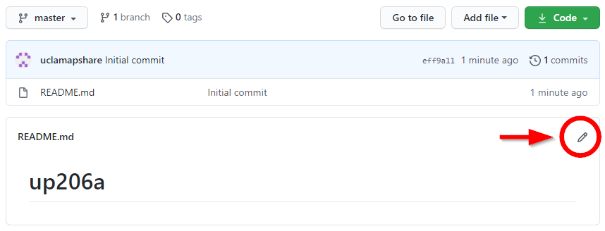

## Creating your class repo

In order to submit assignments, store data, and create your own notebooks, you will need to create a class repository.

### Creating a new repo

Go to GitHub and log in. Click on "repositories" and "new." Follow the screen directions below, but make sure to name your repo `up206a-yourfirstname`.

<kbd></kbd>

Once the repo is created, modify the readme.md file. Add a profile of yourself, a description of the course, project ideas, and your objectives for the class.

<kbd></kbd>

