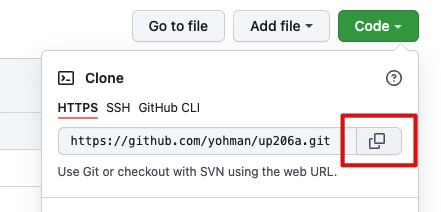
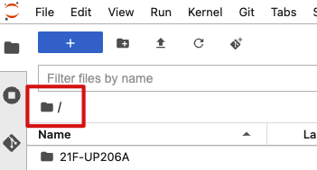
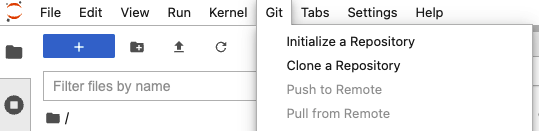
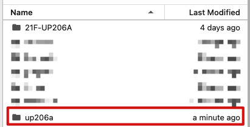

# Clone your repo

Go to your class repo page. The URL should look something like this: 

`https://github.com/your_name/up206a`

Copy the clone URL:

<kbd></kbd>

Launch JupyterHub

Make sure you are at the root folder: 

<kbd></kbd>

In the file menu bar, go to `Git`, `Clone a Repository`:

<kbd></kbd>

Enter (paste) the URL to your repo

You should now see your repo in the root directory:

<kbd></kbd>

From here onwards, this will be your workspace for individual assignments, code experiments, and general data science work related to the class.