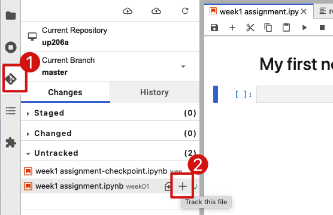
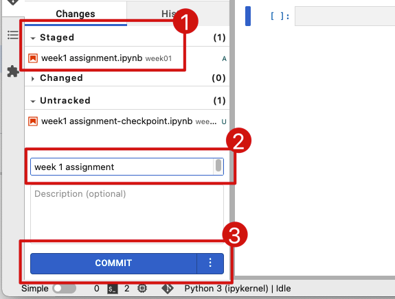
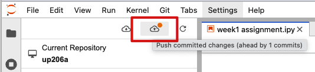

# Commit your changes to your GitHub class repo.

Make sure you are inside your `up206a` folder, and then click on the Git tab on the left side of your JupyterLab panel.

Under the `Untracked` section, you should see all the files that you have modified. Click on the `+` button next to each file, and make sure that it moves to the `Staged` section.

<kbd></kbd>

Add a comment that summarizes your work (ex: Week 1 assignment) and click on the `COMMIT` button.

<kbd></kbd>

You should now see an orange light next to the icon that looks like a cloud with an up arrow. Click on it to push your changes to your repo.

<kbd></kbd>