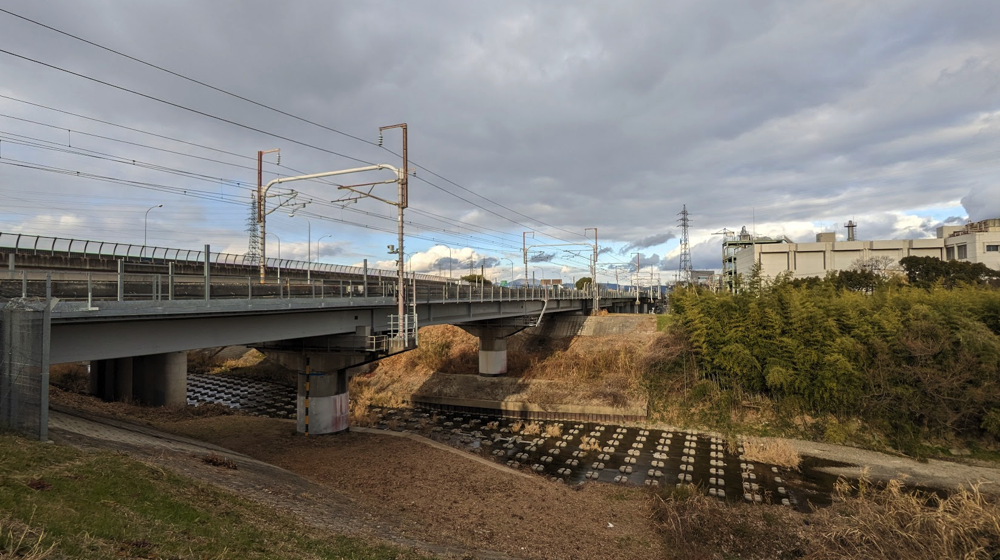
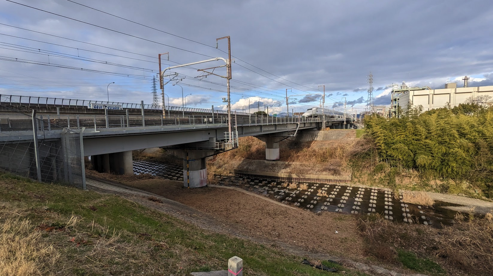
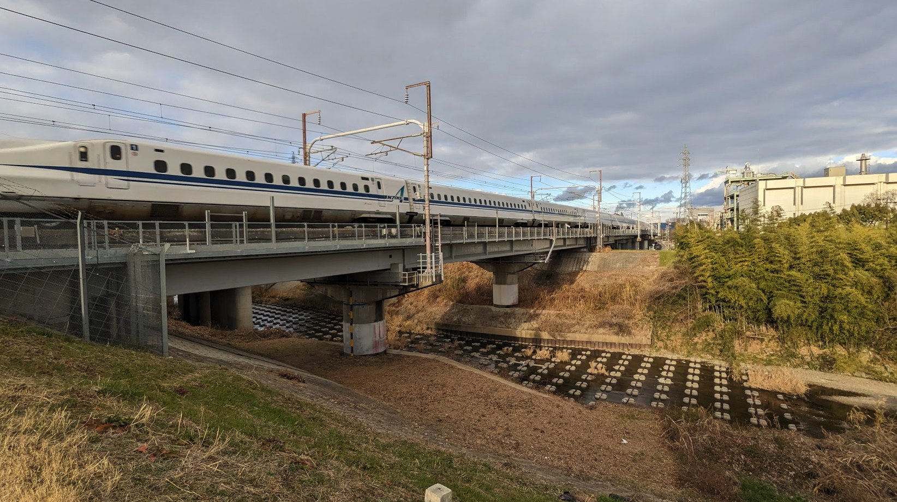
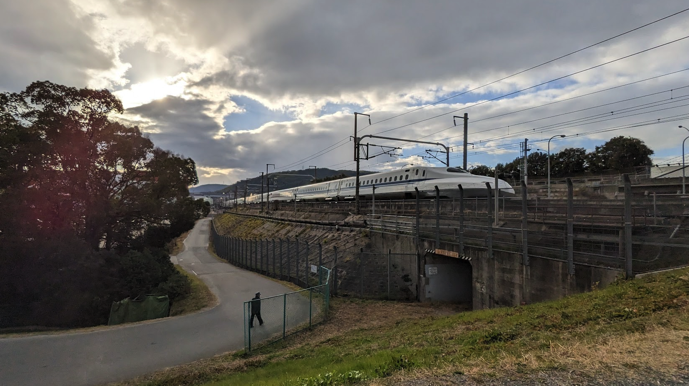

# Week 3

<xl>

Census Data Exploration

</xl>

https://ucla.zoom.us/j/96734931456

January 23, 2023

##
<xl>

*Note that this course will be recorded🎥

</xl>

##

<xl>
A little taste of the Japanese countryside
</xl>

##

##

##

##

## Hands on Lab
First, grab the course material, and "pull" it into your JupyterHub:

* [UP221 Git Puller](https://jupyter.idre.ucla.edu/hub/user-redirect/git-pull?repo=https%3A%2F%2Fgithub.com%2Fyohman%2F23W-UP221&urlpath=lab%2Ftree%2F23W-UP221%2F&branch=main) 
(This link will automatically launch JupyterHub and clone the course material into your directory)

<small>Note that you have to do this at the start of every lecture to get the latest material.
</small>

# Assignments (due 23:59 Sunday, the day before class)

## Group Assignment #1: Project Proposal
The course will largely be guided by your final project, which will be conducted in pairs. Consider that your final project will be a representation of what you learn in this course, and how you apply it on a project level. Consider also that your final project can serve to showcase your data science and mapping skills, which may become a valuable asset for your career moving forward.

### Step 1: Plan
Meet with your partner, discuss and identify a research question, identify and collect data, articulate how you intend to use and analyze it, and begin to speculate how the data can answer your research inquiry. Understand that this may change later, especially as we learn more about what we can do with our methods, and also, as you find the data sources that can or cannot support your research.

### Step 2: Data
Next, identify and download at least two datasets that you believe can guide your research. Make sure that at least one of them has a spatial component. For example, if one of your datasets comes from the census, identify which survey you will use (e.g. Decennial or American Community Survey), and which variables you will select. Note that we will be covering census data in detail in Week 3. Your second dataset should come from a separate source. For example, you may want to do a crime analysis and obtain data from the LA Data Portal.

### Step 3: Create a group repo. 

1. Select a member of the group who will be the main account holder of the repo
2. Create a new repository for your group project
3. Go to Settings, Manage Access, and add your partner as a collaborator
1. Create a Group Assignments folder (hint: click on Add File, Create new File, and enter "Group Assignments/readme.md" in the text box)
4. Create a markdown file for your project proposal

### Step 4: Write your proposal

<medium>

Your project proposal should include the following:
*   An introduction of your research question
*   An explanation of why it is important to you, why it matters to others, and what is at stake
*   A description of the spatial scope (e.g. Boyle Heights or Hong Kong), and why space and/or time matters for your project
*   A preliminary but definitive description of data sources (at least two) that you will use
    * Include datasource with links
*   A scope that explains the intended analysis and resulting visualizations for your project
*   A concluding paragraph of what insights you expect to gain from your research

### Step 5: Submit
Submit your assignment [here](https://github.com/yohman/23W-UP221/discussions/5)
