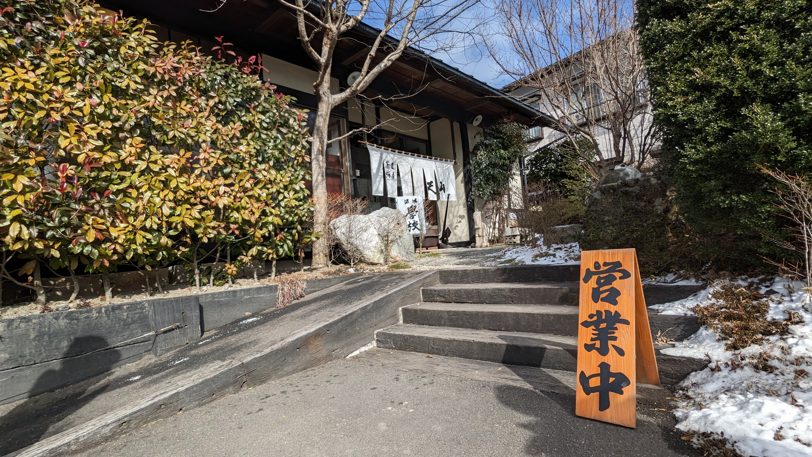
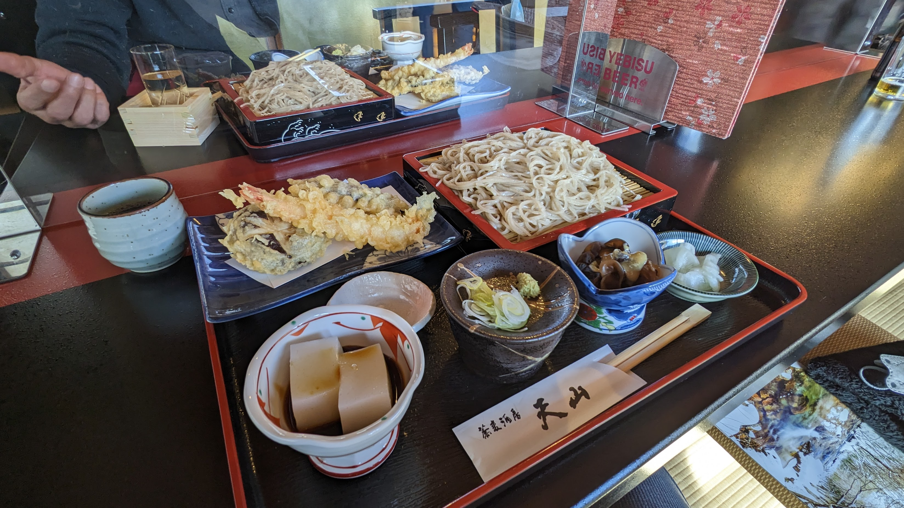

# Week 4

<xl>

Open Data Exploration

</xl>

https://ucla.zoom.us/j/96734931456

January 31, 2023

##
<xl>

*Note that this course will be recorded🎥

</xl>

##

<xl>
Fukushima
</xl>
 
A little taste of the Japanese countryside

##

##

##

##

##

##

##

##

##

##

##

##

## Hands on Lab
First, grab the course material, and "pull" it into your JupyterHub:

* [UP221 Git Puller](https://jupyter.idre.ucla.edu/hub/user-redirect/git-pull?repo=https%3A%2F%2Fgithub.com%2Fyohman%2F23W-UP221&urlpath=lab%2Ftree%2F23W-UP221%2F&branch=main) 
(This link will automatically launch JupyterHub and clone the course material into your directory)

<small>Note that you have to do this at the start of every lecture to get the latest material.
</small>

## Lab: Part 1
<xl>
Code review with open data
</xl>
 
- Break

## Lab: Part 2
<xl>
Mapping arrests
</xl>

# Assignments (due 23:59 Sunday, the day before class)

## Mini Group Assignment

<left>

For this week's group assignment, meet with your partner and submit a status report as a markdown file in your group repo. This will simply be graded as a "done" or "not done" and count towards your participation grade.
</left>

### Instructions

<left>

Include the following sections:

</left>

<small>

* **Project title and link to proposal**
* **Roles**: Give each team member a title, and define what role each team member will play, and how each person plans to contribute to the project. While this may be subject to change, it is a good idea to define this early in the project to clarify "who is doing what."
* **Status update**: Report on the general mood of the team, and provide details as to what is working, and what is not.
* **Data update**: Provide a short narrative on where you are with the data sources you will incorporate in your project. Provide links as necessary.
* **Concerns**: There should be a lot to be concerned about at this phase of the project. List those concerns and classify them as "Major concerns" and/or "Minor concerns."

</small>

### Submit

Submit your updated proposal [here](https://github.com/yohman/23W-UP221/discussions/7).

## Individual Coding Assignment

<left>
The purpose of this week's coding assignment is for you to advance your coding in a direction that makes sense to you, and to the advancement of your group research project. 
</left>

### Instructions
- Use this week to review: redo, add, replace, review, and/or improve upon past assignments to get a better understanding of the materials and coding structures used
- Follow up on this week's lab: create maps for areas that advance your group research
- Be pragramtic: combine elements from various labs to create unique outputs that specifically advance your research inquiry
- Be innovative: experiment with new datasets/features not covered in class (if this requires a new module/library not covered in class, consult with me first)

### Instructions (cont'd)

<left>
This assignment can be as long or as short as you desire. It is meant to review and advance your understanding of course material. To submit:
</left>

- create a new Python 3 notebook for your assignment
- provide a title and explanatory description of what the purpose of the notebook is
- provide ample markdown cells (preferrably before and after each code cell) that explains what you are going to do, and how you interpret the results)
- upload your notebook to your GitHub account

Submit a link to your notebook [here](https://github.com/yohman/23W-UP221/discussions/8).

