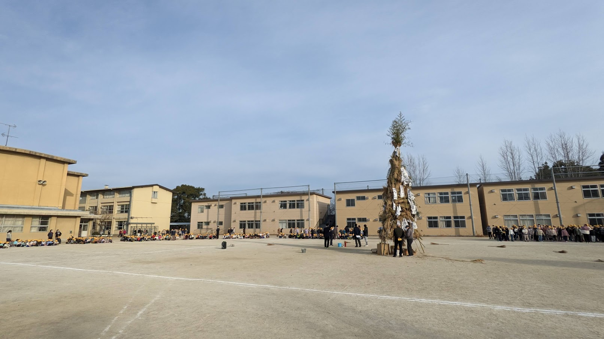
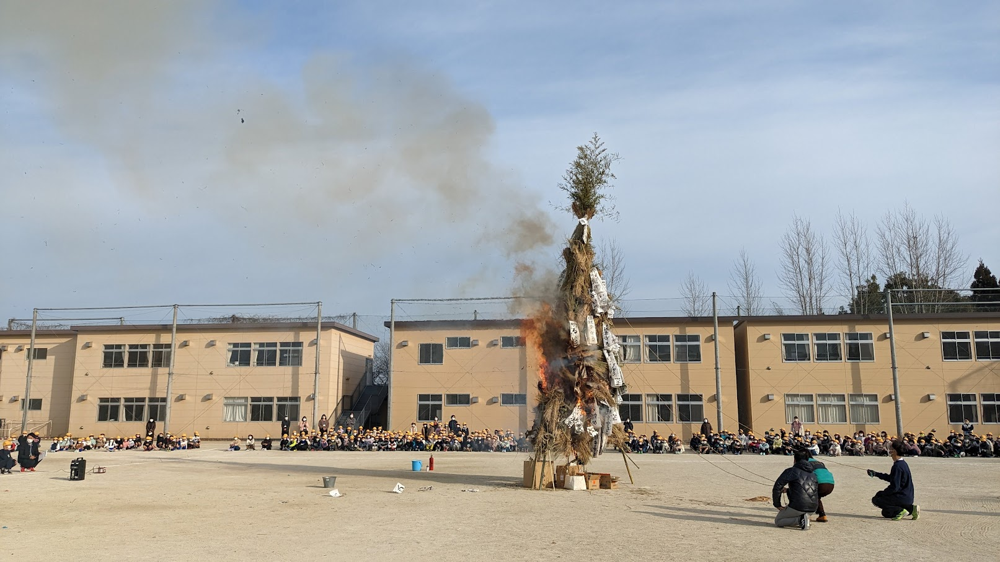
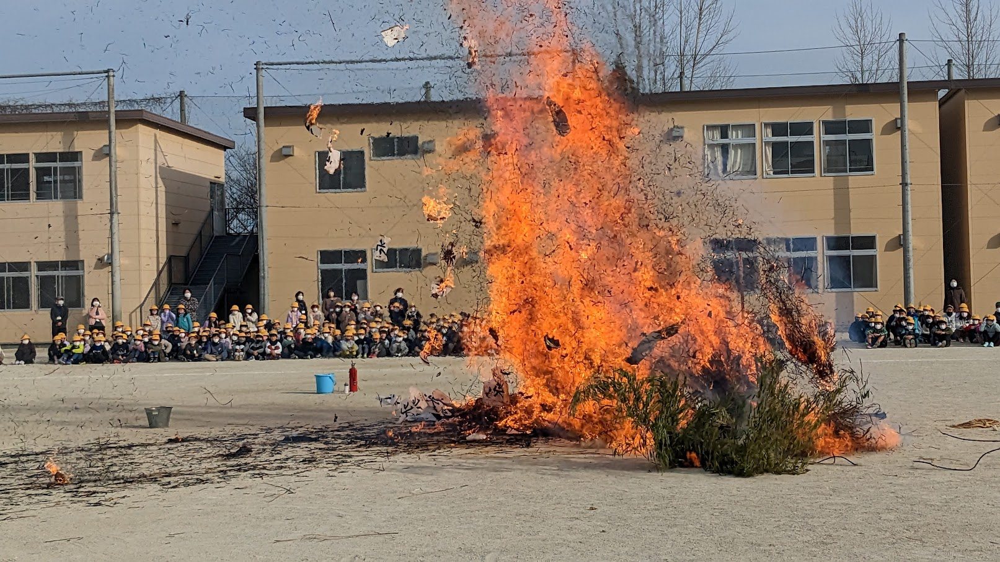
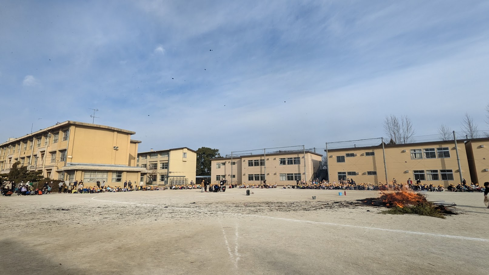

# Week 5

<xl>

Open Street Map

</xl>

https://ucla.zoom.us/j/96734931456

February 6, 2023

##
<xl>

*Note that this course will be recorded🎥

</xl>

##

<xl>
Kyoto Tondo Festival
</xl>
 
A little taste of the Japanese countryside

##

##

##

##

## Hands on Lab
First, grab the course material, and "pull" it into your JupyterHub:

* [UP221 Git Puller](https://jupyter.idre.ucla.edu/hub/user-redirect/git-pull?repo=https%3A%2F%2Fgithub.com%2Fyohman%2F23W-UP221&urlpath=lab%2Ftree%2F23W-UP221%2F&branch=main) 
(This link will automatically launch JupyterHub and clone the course material into your directory)

<small>Note that you have to do this at the start of every lecture to get the latest material.
</small>

## Lab: Part 1
<xl>
    Open Street Maps
</xl>
 
- Break

## Lab: Part 2
<xl>
    Group time!
</xl>

# Midterms (Materials due 5pm Monday, the day of class!)

- [Midterms](../../Midterm%20and%20Finals)
- Presentations
  -  7 minutes per group
  -  Each group member must present a portion of the project, for roughly an equal time of the presentation
  -  You can use any form of visual aids, including powerpoints, google slides, spreadsheets, and/or JupyterNotebooks
  -  Prepare and rehearse
  -  Most importantly, tell a story, and convey why this is an important issue that warrants our attention

## Tips for a good presentation:
- Images are worth 1000 words (i.e. minimal use of bullet points)
- Let your visuals narrate the story you tell, not text or bullet points
- Talk to the audience, not your computer or the screen
- Show your passion!

Submit your midterm materials [here](https://github.com/yohman/23W-UP221/discussions/9)