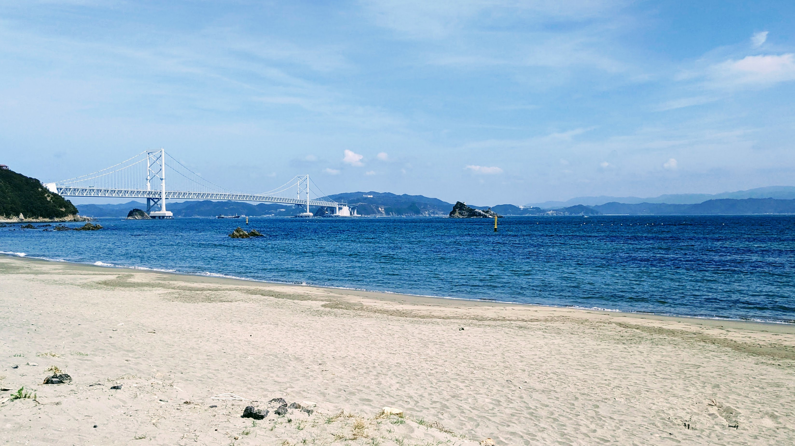
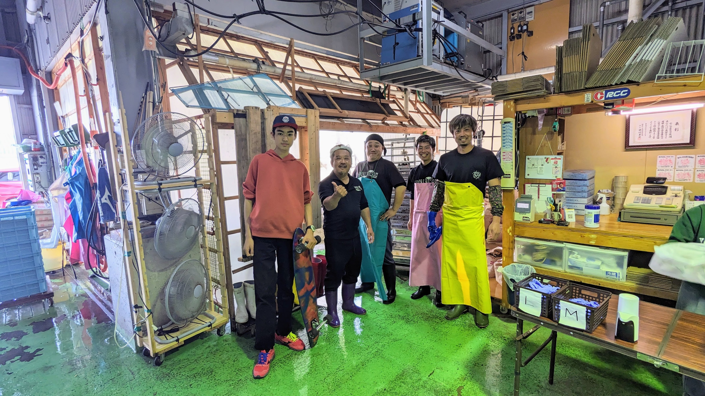

## Week 10: March 12, 2023

<xl>

Scraping, remote sensing, and TA magic

</xl>

https://ucla.zoom.us/j/96734931456

## Let's pull

First, grab the course material, and "pull" it into your JupyterHub:

* [UP221 Git Puller](https://jupyter.idre.ucla.edu/hub/user-redirect/git-pull?repo=https%3A%2F%2Fgithub.com%2Fyohman%2F23W-UP221&urlpath=lab%2Ftree%2F23W-UP221%2F&branch=main) 
(This link will automatically launch JupyterHub and clone the course material into your directory)

<small>Note that you have to do this at the start of every lecture to get the latest material.
</small>

##
<xl>

This course will be recorded  🎥

</xl>

##

<xl>
淡路島 Awajishima
</xl>

 

##

##

##

##

##
<xl>[Thick mapping](https://docs.google.com/presentation/d/1b3M9o0n50DcHpdlTCjqih-Qs5T45ORMl7lvZR_QcD3Y/edit?usp=sharing)

</xl>

##

<xl>
Chris and Elliot
</xl>

Our amazing spatial scholars

## Today's lab

- Metro scraping!
- Remote sensing 101

## Final project presentations

<xl>
March 20th, Monday 5pm~

</xl>

 

- [Submission guidelines](../../Midterm%20and%20Finals/#final-project-30-of-your-final-grade)